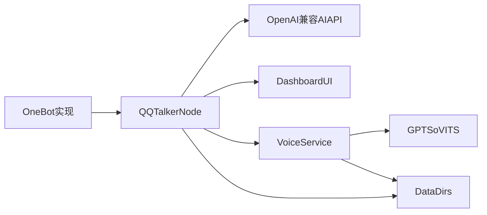

# QQTalker 架构说明

## 总览

QQTalker 由两个主要进程组成：

- Node.js 主服务：接收 OneBot 消息、维护上下文、调用 AI、编排插件、提供 Dashboard。
- Python `voice-service`：扫描本地模型目录，对接 `GPT-SoVITS` 或 `edge-tts`，向主服务暴露统一语音接口。

此外，项目依赖一个外部 OneBot 实现和一个可选的本机 `GPT-SoVITS` 服务。

## 进程与端口

- `WS_URL`: OneBot 正向 WebSocket 地址，代码默认回退到 `ws://127.0.0.1:8080`。
- `http://127.0.0.1:3180`: Node 侧 Dashboard。
- `http://127.0.0.1:8765`: Python `voice-service`。
- `http://127.0.0.1:9880`: 常见本机 `GPT-SoVITS` API 地址。

## 主服务装配顺序

入口在 `src/index.ts`，启动顺序大致如下：

1. 读取并校验配置。
2. 创建 `OneBotClient`、`CodeBuddyClient`、`SessionManager`、`BlockService`、`DashboardService`、`PluginManager`、`PersonaService`。
3. 将 `PersonaService` 注入 `DashboardService`；创建 `MessageHandler` 并注入 Dashboard、屏蔽服务、`PluginManager`，随后注入 `PersonaService`（Astrbot 转发链路也会复用人格解析）。
4. 注册内置插件：
   - `SelfLearningPlugin`（受 `SELF_LEARNING_ENABLED` 控制）
   - `VoiceBroadcastPlugin`
5. `loadExternalPlugins()`：按 `PLUGIN_PATHS` 与 `data/plugins/registry.json` 恢复外部插件，再 `initialize` 插件上下文（含 `personas`、`dashboard` 等）。
6. 连接 OneBot。
7. 创建并启动 `SchedulerService`（注入 `PersonaService` 等依赖，用于定时插话等人格一致行为），启动 Dashboard HTTP 与通知监听。

这意味着大多数业务能力并不直接写在入口里，而是通过 `MessageHandler` 和插件协同完成。

## 核心组件职责

### OneBotClient

- 位于 `src/services/onebot-client.ts`
- 负责连接 OneBot WebSocket
- 负责发送群消息、私聊消息、语音消息
- 负责获取合并转发和语音文件
- 内置心跳、断线重连、路径兜底尝试

### CodeBuddyClient

- 位于 `src/services/codebuddy-client.ts`
- 使用 OpenAI 兼容接口发起聊天补全
- 把群聊模式、私聊模式和插件注入的 system prefix 统一拼成请求
- 最终发往模型的 system 内容还会叠上 `MessageHandler` 侧的人格层（Persona + 自学习 overlay）

### PersonaService

- 位于 `src/services/persona-service.ts`
- 维护人格档案（profile）、默认人格、群到人格的绑定
- 默认持久化到项目根下 `data/personas.json`（路径以该类的构造函数默认参数为准，当前未集中在 `config.ts`）
- 与自学习插件协作：`SelfLearningService` 可提供 overlay，`PersonaService` 负责与基础 prompt、relay 口径、TTS 角色字段等合成 `ResolvedPersona` 供消息与转发链路使用

### SessionManager

- 位于 `src/services/session-manager.ts`
- 管理群共享模式和个人模式两套上下文
- 默认群共享模式，按群存历史
- 切换个人模式后，按群 + 用户存历史

### MessageHandler

- 位于 `src/handlers/message-handler.ts`
- 是主业务入口
- 负责 STT、Vision、模式切换、占卜、插件命令、自学习上下文、Astrbot 转发、AI 回复、TTS 追加发送
- 内置发送限速和简单风控规避逻辑

### DashboardService

- 位于 `src/services/dashboard-service.ts`
- 提供 HTTP API、SSE、静态资源托管、日志分析入口和本地 `.env` 更新
- 既服务内置 Dashboard，也承载插件自定义路由

### PluginManager

- 位于 `src/plugins/plugin-manager.ts`
- 统一管理内置插件、`PLUGIN_PATHS` 指向的模块，以及插件中心写入注册表的外部插件
- 内置 `PluginAdapterRegistry`：安装阶段由 `AstrBotBridgeAdapter` 识别 AstrBot 形态包；运行时再装载为 `AstrBotGenericBridgePlugin` 或 `AstrBotMemeManagerBridgePlugin`，共享 manifest 构建逻辑在 `astrbot-bridge-support.ts`
- 提供消息钩子、Prompt 注入、命令处理、Dashboard 路由注册与插件 UI 注册表
- 插件文件布局与可选数据根覆盖见 `plugin-fs.ts`（`QQTALKER_PLUGIN_DATA_ROOT`）

## 目录边界

- `src/`: 主应用代码
- `dashboard-assets/`: Dashboard 前端静态资源
- `voice-service/`: Python 语音服务
- `data/voice-models/`: 模型目录与训练工作区
- `data/self-learning/`: 自学习数据库和导出数据
- `data/plugins/`: 插件中心注册表、锁文件、各插件配置与包体、运行时目录（根路径可被环境变量覆盖）
- `data/personas.json`: 人格档案与群绑定（默认路径，真源见 `PersonaService`）
- `scripts/voice-training/`: 训练数据处理脚本
- `tests/e2e/`: Dashboard 端到端测试和 mock server

## 设计特点

- Node 主服务和 Python 语音服务解耦，方便单独调试语音链路。
- Dashboard 不是独立前端构建产物，而是由 Node 直接托管静态资源。
- 自学习能力以插件形态接入，尽量减少对主消息链路的硬编码。
- 训练脚本与线上运行链路分离，保留实验资产但不强耦合到默认启动流程。

## 开发时要牢记的事实

- 这个项目不是单进程服务，语音能力依赖外部或本机额外服务。
- `README.md` 更适合做首页，详细解释应放在 `docs/`。
- 运行时真正生效的默认值，以 `src/types/config.ts` 为准，不以示例 `.env` 为准；人格默认文件路径以 `PersonaService` 为准。
