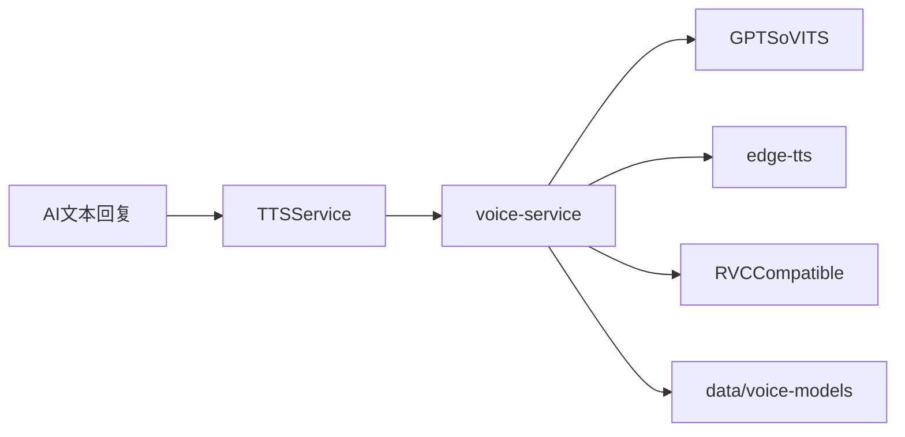

# 语音链路与训练体系

## 角色划分

QQTalker 的语音能力分成三层：

- Node 主服务：决定何时发语音、向哪个服务请求语音
- `voice-service`：负责本地模型目录扫描、后端路由和统一 HTTP API
- 上游语音引擎：常见为 `GPT-SoVITS`，可选 `edge-tts` 或历史 `RVC Compatible`

## 运行链路



## `voice-service` 的职责

`voice-service/README.md` 对它的目标定义很清楚，实际职责包括：

- 扫描 `data/voice-models/`
- 暴露统一的 HTTP API 给 QQTalker
- 根据模型元数据决定调用 `gpt-sovits`、`edge-tts` 或其他后端
- 在模型未准备好时提供回退

主服务默认通过 `TTS_SERVICE_URL=http://127.0.0.1:8765` 访问它。

## 模型目录

推荐结构在 `data/voice-models/README.md` 中已有定义，重点如下：

- 根目录可放 `catalog.json`
- 每个角色子目录也可放 `voice-model.json`
- 每个角色通常包含：
  - `reference.wav`
  - 若干 `aux-*.wav`
  - `model.ckpt`
  - 可选的 `rvc/` 实验产物

这些文件不一定都随仓库分发，很多属于本机资产。

## 关键配置

### Node 主服务

- `TTS_ENABLED`
- `TTS_PROVIDER`
- `TTS_SERVICE_URL`
- `TTS_BACKEND`
- `TTS_MODEL`
- `TTS_MODEL_DIR`
- `TTS_REPLY_MODE`
- `TTS_DEFAULT_CHARACTER`
- `TTS_CHARACTER_MODEL_MAP`
- `TTS_GROUP_VOICE_ROLE_MAP`

### Python `voice-service`

- `VOICE_MODEL_DIR`
- `VOICE_DEFAULT_BACKEND`
- `VOICE_GPTSOVITS_UPSTREAM`
- `VOICE_RVC_UPSTREAM`
- `VOICE_EDGE_DEFAULT`

## 推荐联调顺序

1. 先确认 `GPT-SoVITS` 本身能返回音频。
2. 再确认 `voice-service` 的 `/health`、`/models`、`/preview` 正常。
3. 最后再从 QQTalker 的 Dashboard 或群聊触发 TTS。

这样更容易定位问题是在上游推理、模型目录、`voice-service` 还是主服务。

## 启动约定

`start-voice-stack.ps1` 假设目录结构如下：

```text
CodeBuddyWorkSpace/
  QQTalker/
  GPT-SoVITS/
```

脚本会依次检查：

- `http://127.0.0.1:9880/docs`
- `http://127.0.0.1:8765/health`
- `http://127.0.0.1:3180/api/status`

所以它更像“本机开发联调启动器”，而不是通用部署脚本。

## 训练工作区

`data/voice-models/training/README.md` 说明了训练目录和脚本矩阵。开发上需要记住：

- `raw/` 保留原始来源
- `cleaned/` 是清洗后音频
- `segments/` 是训练切片
- `manifests/` 记录元数据和训练集划分
- `train/` 记录训练版本、参数和试听结论

## 训练脚本用途

- `voice:training:sync`
  同步训练工作区摘要
- `voice:download`
  拉取公开素材
- `voice:clips:suggest`
  自动建议可切片区间
- `voice:clips`
  批量切片
- `voice:transcribe`
  用 STT 为切片补 transcript 草稿
- `voice:manifest`
  生成训练 manifest 和数据集文件
- `voice:rvc:import`
  导入外部 RVC 训练产物
- `voice:eval`
  生成试听对比和评测结果

## 当前上线口径

从现有 README、子文档和脚本看，当前默认上线口径是：

- `GPT-SoVITS` 为主链路
- `edge-tts` 为保底回退
- `RVC` 代码和脚本保留，但不属于默认上线范围

因此文档或代码变更时，不要把 RVC 误写成当前主路径。

## 常见问题

### 主服务能发文字但不发语音

- 大多是 `voice-service` 不可达或模型未命中

### `voice-service` 正常但音色不对

- 检查 `TTS_MODEL`
- 检查 `TTS_DEFAULT_CHARACTER`
- 检查 `TTS_CHARACTER_MODEL_MAP`
- 检查角色目录里的 `voice-model.json` 或 `catalog.json`

### 模型存在但列表里看不到

- 检查 `VOICE_MODEL_DIR`
- 检查模型描述文件是否缺字段
- 检查文件路径是否是相对模型目录可解析的路径
